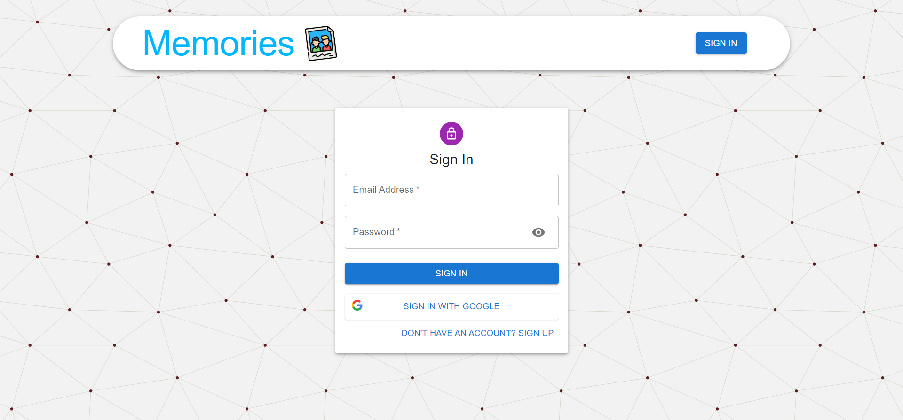
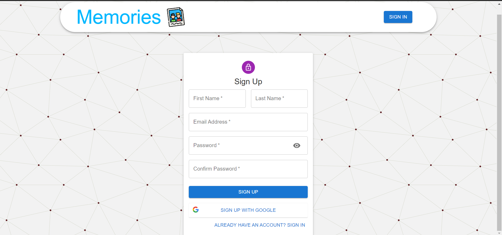
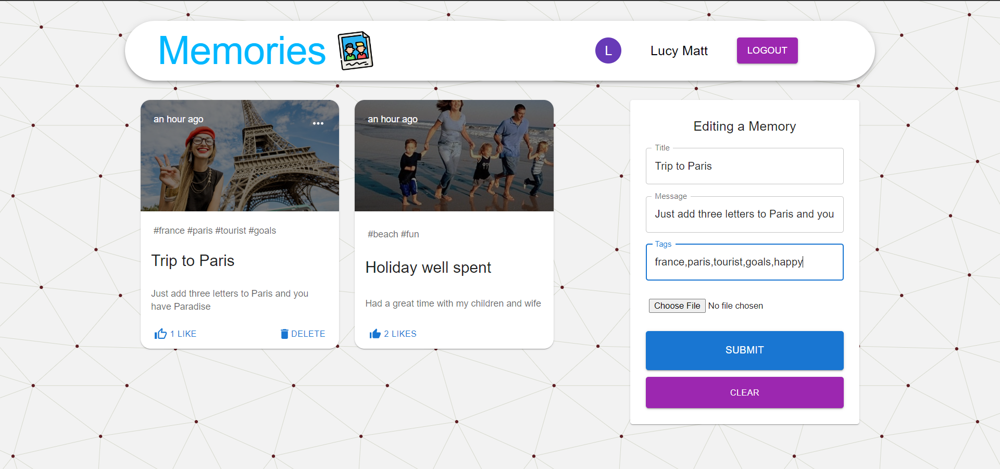

# Full Stack Project using MERN
## Introduction
The [project](https://photo-diaries.netlify.app/) aims at implementing a full stack web application with dedicated server and client side.
The server side responds in JSON format which makes the frontend scalable and flexible.

 - **React** with Material UI for Frontend.
 - **Express** as Web Application Framework.
 - **Redux-Toolkit** for State Management
 - **Node JS** for Backend. 
 - **MongoDB (Mongoose)** for Database.
 - **Git/Github** for version control.
 - **Netlify** for [frontend](https://photo-diaries.netlify.app/) deployment
 - **Render** for [backend](https://mernappbackhend.onrender.com/) deployment

## Overview
The application consists of a fully operational authentication system. The users can 
login with their email (JWT) or choose to Sign in with Google (using Firebase).
It is a single page application with responsive UI. The users can create, update , delete their posts. They can also like other's posts.

Showing all the posts. The posts created by the logged in users has extra functionality of editing and deleting the post.  
 

User can login using email of already created account or they can signin with google.
 

User can create a new account or they can choose to signup with google.
 

Authorised user can edit their post by clicking on three dots in the top right corner of their post.
They can also choose to delete their post using delete icon.

# References
 1. https://reactjs.org/docs/getting-started.html
 2. https://redux-toolkit.js.org/tutorials/quick-start
 3. https://mui.com/material-ui/getting-started/overview/
 4. https://mongoosejs.com/docs/guide.html
 5. https://jwt.io/
 6. https://firebase.google.com/docs
 7. https://nodejs.org/en/docs/
